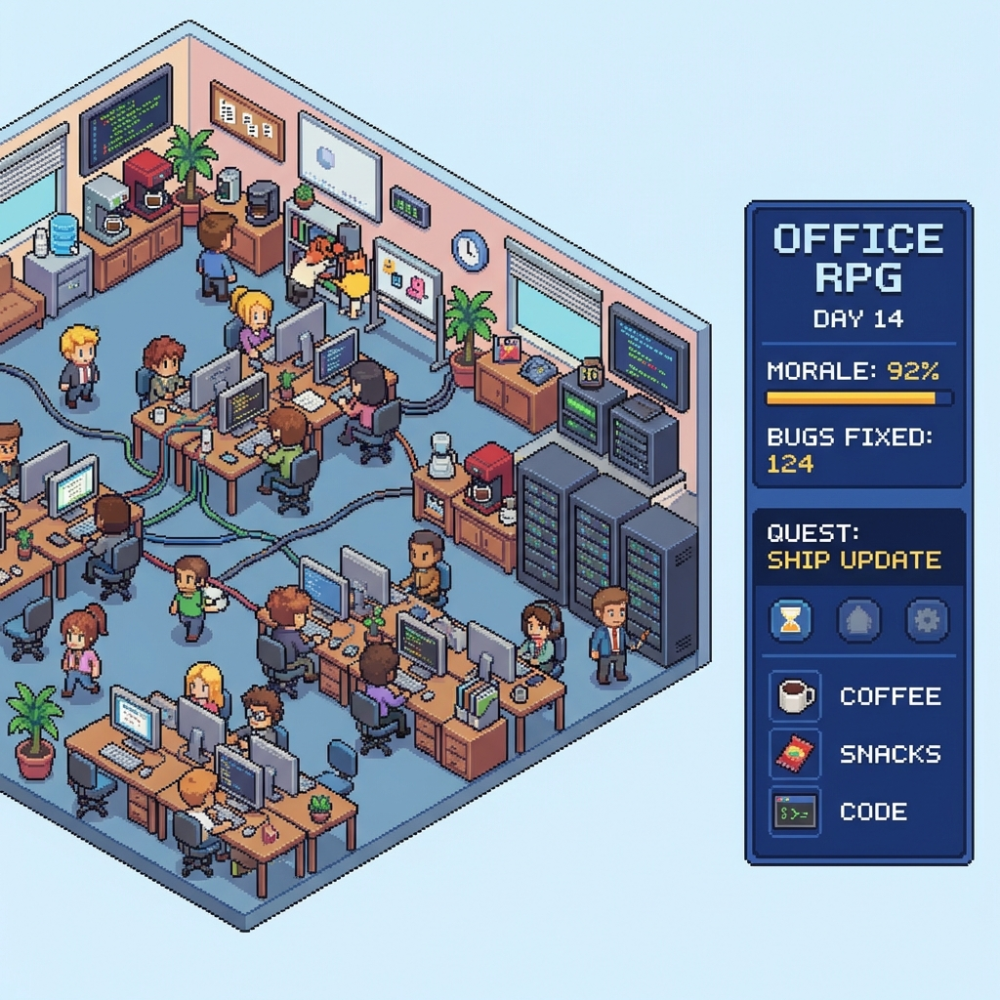

# OpenCode Pixel Office

Pixel office visualization that listens to OpenCode plugin events and renders agent activity in real time.

## Project

Pixel Office is an OpenCode plugin that visualizes agent activity in a live office scene. It starts a local dashboard, streams OpenCode events, and renders agent state, messages, and movement in real time.

## Installation

See `docs/installation.md` for end‑user and LLM‑agent setup instructions.

## Docs website

Docs are served from GitHub Pages using `/docs`:

`https://<your-username>.github.io/<your-repo>/`

## Screenshots




## Credits

Office tileset art: https://donarg.itch.io/officetileset

## Maintainer guide

### Local dev

```bash
npm install
npm run build:client
npm start
```

```

## Event mapping

The UI maps common OpenCode events into activity states:

- `tool.execute.before` -> working
- `tool.execute.after` / message events -> thinking
- `session.idle` -> idle
- `session.error` -> error
- `session.compacted` -> planning

If `session.status` emits a concrete status string, the UI will use it directly.
