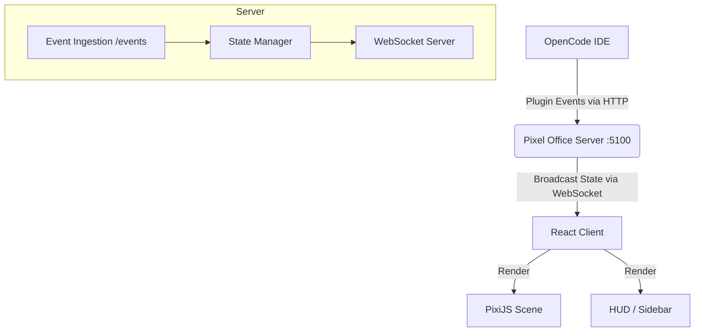

# Pixel Office

Pixel Office is an OpenCode plugin that visualizes agent activity (LLM thoughts, tool usage, file modifications) in a live, retro-style office scene.


## Overview

The system consists of three main parts:
1.  **OpenCode Plugin**: Captures events from the IDE/Agent execution.
2.  **Server**: A Node.js Express/WebSocket server that aggregates state.
3.  **Client**: A React + PixiJS dashboard that renders the "Office" and "HUD".

## System Architecture



## Project Structure

```text
pixel-opencode/
├── client/                 # Frontend Dashboard
│   ├── src/
│   │   ├── components/     # UI Components (HUD, Panels)
│   │   ├── PixiScene.tsx   # Core Game Loop & Rendering (PixiJS)
│   │   ├── useOfficeState.ts # State Management & WebSocket Hook
│   │   └── styles.css      # Retro Theme Styles (Tailwind + CSS Variables)
│   └── vite.config.ts      # Client Build Config
├── server/                 # Backend
│   └── index.ts            # Express App & Event Handling
├── plugin/                 # OpenCode Integration
│   └── pixel-office.js     # Script to forward IDE events
└── bin/                    # Executable binaries
```

## Key Components

### 1. `PixiScene.tsx`
The heart of the visualization. It handles:
-   **Sprite Management**: Rendering agents, furniture, and effects.
-   **Pathfinding**: A* algorithm for agent movement (using `pathfinding.ts`).
-   **Game Loop**: Updates positions and animations at 60fps.

### 2. `useOfficeState.ts`
A custom React hook that:
-   Maintains the WebSocket connection.
-   Merges incoming event deltas into the current `OfficeState`.
-   Manage active sessions, todos, and agent statuses.

### 3. `plugin/pixel-office.js`
A standard OpenCode plugin script that hooks into the event bus:
-   `agent` events (thoughts, tools)
-   `session` events (status changes)
-   `fs` events (file modifications)

## Setup & Installation

### 1. Start the Server
```bash
npm install
npm start
# Server runs on http://localhost:5100
```

### 2. Install the Plugin
Copy the plugin script to your OpenCode configuration:
```bash
mkdir -p .opencode/plugins
cp plugin/pixel-office.js .opencode/plugins/
```
Restart OpenCode to activate.

## Development

-   **Client Dev**: `npm run dev:client` (Vite dev server)
-   **Server Dev**: `npm start` (Runs via `tsx`)

## Credits
-   **Tileset**: [Office Tileset by DonArg](https://donarg.itch.io/officetileset)
-   **Icons**: Lucide React
-   **Engine**: PixiJS
