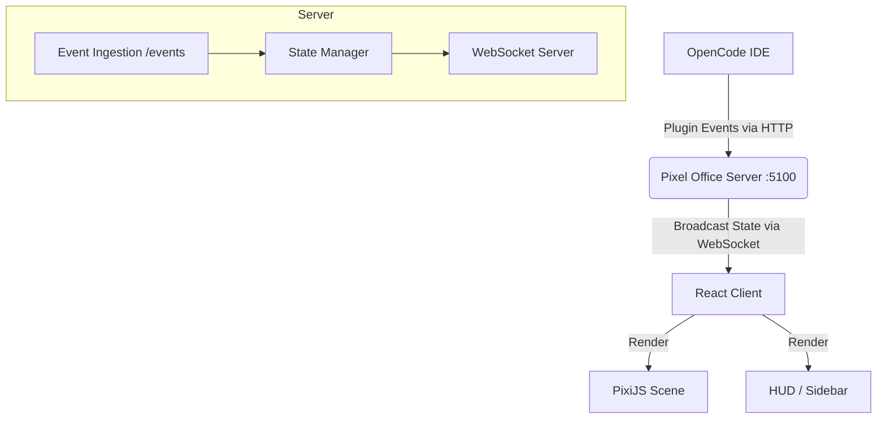

# Pixel Office

Pixel Office is an OpenCode plugin that visualizes agent activity (LLM thoughts, tool usage, file modifications) in a live, retro-style office scene.

https://www.npmjs.com/package/opencode-pixel-office

## Overview

The system consists of three main parts:
1.  **OpenCode Plugin**: Captures events from the IDE/Agent execution.
2.  **Server**: A Node.js Express/WebSocket server that aggregates state.
3.  **Client**: A React + PixiJS dashboard that renders the "Office" and "HUD".

## System Architecture



## Project Structure

```text
pixel-opencode/
├── client/                 # Frontend Dashboard
│   ├── src/
│   │   ├── components/     # UI Components (HUD, Panels)
│   │   ├── PixiScene.tsx   # Core Game Loop & Rendering (PixiJS)
│   │   ├── useOfficeState.ts # State Management & WebSocket Hook
│   │   └── styles.css      # Retro Theme Styles (Tailwind + CSS Variables)
│   └── vite.config.ts      # Client Build Config
├── server/                 # Backend
│   └── index.ts            # Express App & Event Handling
├── plugin/                 # OpenCode Integration
│   └── pixel-office.js     # Script to forward IDE events
└── bin/                    # Executable binaries
```

## Key Components

### 1. `PixiScene.tsx`
The heart of the visualization. It handles:
-   **Sprite Management**: Rendering agents, furniture, and effects.
-   **Pathfinding**: A* algorithm for agent movement (using `pathfinding.ts`).
-   **Game Loop**: Updates positions and animations at 60fps.

### 2. `useOfficeState.ts`
A custom React hook that:
-   Maintains the WebSocket connection.
-   Merges incoming event deltas into the current `OfficeState`.
-   Manage active sessions, todos, and agent statuses.

### 3. `plugin/pixel-office.js`
A standard OpenCode plugin script that hooks into the event bus:
-   `agent` events (thoughts, tools)
-   `session` events (status changes)
-   `fs` events (file modifications)

## 📱 Mobile Support

Monitor your agents from your phone or tablet!

-   **Network Access**: The server automatically binds to your LAN IP.
-   **QR Code**: In the dashboard, click the Network URL in the top-right corner to reveal a QR code. Scan it to instantly connect.
-   **Responsive Design**: The dashboard adapts to portrait and landscape modes on mobile devices.


## Installation

### 🚀 For Users (The Easy Way)

1.  **Install the Global Package**:
    ```bash
    npm install -g opencode-pixel-office
    ```

2.  **Run the Installer**:
    ```bash
    opencode-pixel-office install
    ```
    This sets up the standalone app in `~/.opencode/pixel-office` and installs the `pixel-office.js` plugin script to `~/.opencode/plugins/`.

3.  **Start OpenCode**:
    Simply open your IDE. Pixel Office will auto-launch in your browser at `http://localhost:5100`.

### 🛠️ For Developers

If you want to modify the source code or contribute:

#### 1. Clone & Install
```bash
git clone https://github.com/your-username/opencode-pixel-office.git
cd opencode-pixel-office
npm install
```

#### 2. Start the Server (Dev Mode)
```bash
npm start
# Server runs on http://localhost:5100, watching for changes
```

#### 3. Start the Client (Dev Mode)
In a separate terminal:
```bash
npm run dev:client
```

#### 4. Install the Plugin (Dev Mode)
To use your *local* version instead of the global one:
```bash
mkdir -p ~/.opencode/plugins
cp plugin/pixel-office.js ~/.opencode/plugins/
```
(The plugin automatically prefers your local `server/` if you are opening the `pixel-opencode` project in OpenCode.)

#### 2. Install the Plugin (Dev Mode)
Copy the plugin script to your OpenCode configuration:
```bash
mkdir -p .opencode/plugins
cp plugin/pixel-office.js .opencode/plugins/
```
Restart OpenCode to activate.

## Development

-   **Client Dev**: `npm run dev:client` (Vite dev server)
-   **Server Dev**: `npm start` (Runs via `tsx`)

## Credits
-   **Tileset**: [Office Tileset by DonArg](https://donarg.itch.io/officetileset)
-   **Icons**: Lucide React
-   **Engine**: PixiJS
